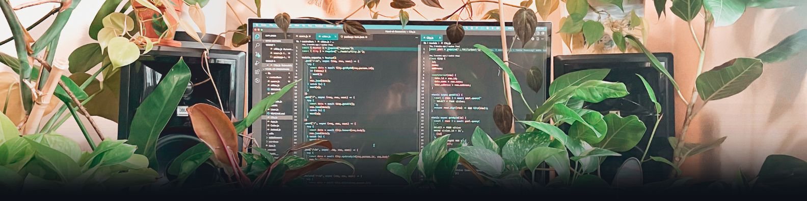
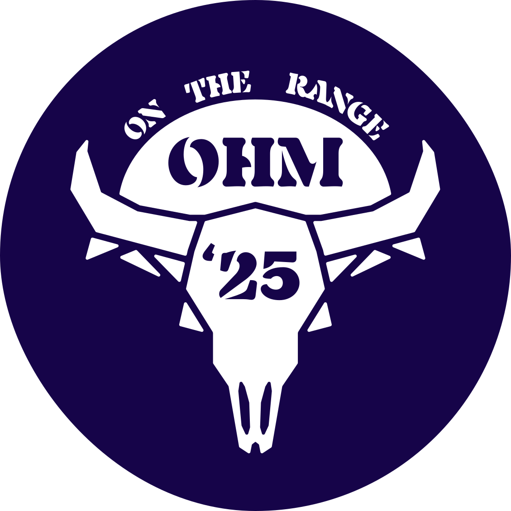

# 👋 Hello, I'm Rio.

Full-stack engineer with 3+ years shipping maintainable web and mobile software. Comfortable owning UI, APIs, data, and deployment across startup builds and compliance-heavy environments.

[![Website](https://img.shields.io/static/v1?message=Website&color=2D645D&label=%20&style=for-the-badge&logo=data:image/svg%2Bxml;base64,PHN2ZyB3aWR0aD0iMjU2IiBoZWlnaHQ9IjI1NiIgdmlld0JveD0iMCAwIDI1NiAyNTYiIGZpbGw9Im5vbmUiIHhtbG5zPSJodHRwOi8vd3d3LnczLm9yZy8yMDAwL3N2ZyI+CjxyZWN0IHg9IjQuMDEzODkiIHk9IjQuMDEzODkiIHdpZHRoPSIyNDcuOTcyIiBoZWlnaHQ9IjI0Ny45NzIiIHJ4PSIxMjMuOTg2IiBmaWxsPSIjRUNERkNBIi8+CjxyZWN0IHg9IjQuMDEzODkiIHk9IjQuMDEzODkiIHdpZHRoPSIyNDcuOTcyIiBoZWlnaHQ9IjI0Ny45NzIiIHJ4PSIxMjMuOTg2IiBzdHJva2U9IiMyRDY0NUQiIHN0cm9rZS13aWR0aD0iOC4wMjc3OCIvPgo8cGF0aCBkPSJNNTcuNjQ5NCAyMDYuMjM1VjIwMi44NDFDNjUuMTE3NSAxOTkuODk5IDY4Ljk2NDcgMTgyLjQ3MyA2OC45NjQ3IDE1MC43OTFWMTAzLjI2N0M2OC45NjQ3IDcxLjU4MzggNjUuMTE3NSA1NC4xNTgzIDU3LjY0OTQgNTEuMjE2NFY0Ny44MjE4SDEyOS4zODhDMTcxLjAyOCA0Ny44MjE4IDE4OC4wMDEgNTkuMTM3IDE4OC4wMDEgODkuNDYxOUMxODguMDAxIDExMy45MDMgMTc3LjEzOCAxMjQuNTM5IDE0Ni4xMzUgMTI3LjQ4MVYxMjkuMDY1QzE3NS43ODEgMTMxLjEwMiAxODMuOTI4IDEzOS40NzUgMTg5LjEzMyAxNjUuMjc0QzE5My40MzIgMTg3LjIyNiAxOTkuMDkgMTk5Ljg5OSAyMDUuNjUzIDIwMi44NDFWMjA2LjIzNUgxNzUuNzgxQzE1NC41MDggMjA2LjIzNSAxNDMuNjQ1IDIwMi4xNjIgMTQxLjYwOSAxODkuMjYyTDEzNi42MyAxNTYuNjc1QzEzNC4xNDEgMTQwLjgzMyAxMjkuMTYyIDEzMi4wMDcgMTE4Ljc1MiAxMzAuODc2VjE1MC43OTFDMTE4Ljc1MiAxODIuNDczIDEyMi41OTkgMTk5Ljg5OSAxMzAuMDY3IDIwMi44NDFWMjA2LjIzNUg1Ny42NDk0Wk0xMjIuODI1IDEyNC45OTJDMTMzLjIzNSAxMjQuOTkyIDEzOS41NzIgMTA5LjE1IDEzOS41NzIgODcuODc3OEMxMzkuNTcyIDY4LjE4OTIgMTM0LjE0MSA1NC42MTA5IDEyNy4xMjUgNTQuNjEwOUMxMjEuNDY3IDU0LjYxMDkgMTE4Ljc1MiA2Mi43NTc5IDExOC43NTIgMTAzLjI2N1YxMTUuNzEzQzExOC43NTIgMTIzLjE4MSAxMTkuMjA0IDEyNC45OTIgMTIyLjgyNSAxMjQuOTkyWiIgZmlsbD0iIzJENjQ1RCIvPgo8L3N2Zz4K)](https://rioedwards.com)

---

## 👨‍💻 Recent Projects

 &nbsp; DogTown &nbsp;  

A self-hosted photo-sharing app running on my Raspberry Pi 5 with OAuth auth, AI image moderation, and a real-time monitoring dashboard. Features Docker orchestration, CI/CD via GitHub Actions, and NGINX caching.

**Stack:** Next.js, React, TypeScript, Postgres, Docker, Python/FastAPI, Hono, Cloudflare Tunnel

[Visit](https://dogtown.dog) • [GitHub](https://github.com/rioredwards/pi-site)

 

&nbsp;  Ohm on the Range &nbsp;  

Festival website redesign that more than doubled traffic (3,000+ unique visitors first month) with near-perfect Lighthouse scores. Features a type-safe content pipeline generating UI, screen-reader content, and JSON-LD structured data from a single source.

**Stack:** Next.js, TypeScript, Tailwind, shadcn/ui, Figma, Vercel

[Visit](https://www.ohmontherange.net) • [Case Study](https://rioedwards.com/work/ohm-on-the-range)

 

&nbsp;  Error Affirmations &nbsp;  

 

A full-stack app that provides an API for delivering code-related affirmations to developers. The application includes 3 UI's: a VSCode Extension, a Jest Reporter and a website. 1,000+ downloads.

[VS Code Extension](https://marketplace.visualstudio.com/items?itemName=VSCodeEmpaths.erroraffirmations) • [Jest Reporter](https://www.npmjs.com/package/error-affirmations) • [Website](https://error-affirmations.netlify.app/) • [GitHub](https://github.com/orgs/VSCode-Empaths/repositories)

  

&nbsp; Swimmy Nudibranch &nbsp;  

An aquatic spin on the (in)famous iPhone game: "Flappy Bird". I built this with a small team for a 3-day hackathon, the theme being "Under the Sea". It features all original pixel art and music.

[Play](https://swimmy-nudibranch.netlify.app/) • [GitHub](https://github.com/Nervous-Nudibranchs/Swimmyy-Nudibranch)

 

 
 ---

## 🛠️ My Toolkit

**Languages**

**Frameworks & Libraries**

**Databases & Backend**

**Cloud & DevOps**

**Tools**

