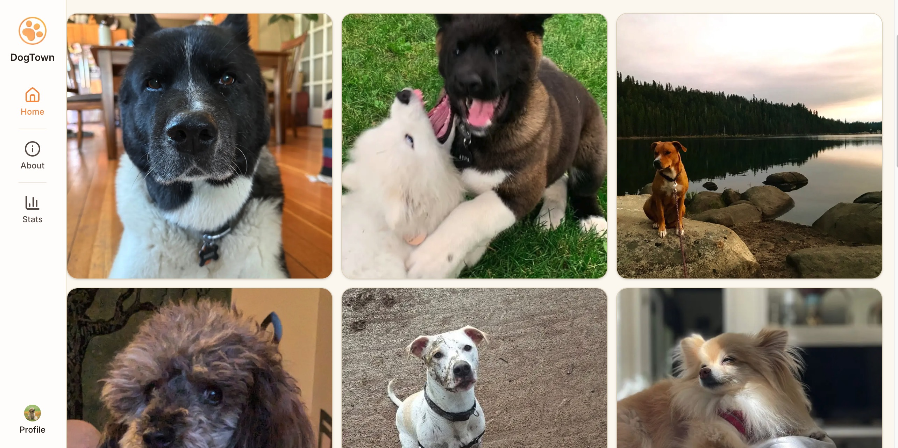
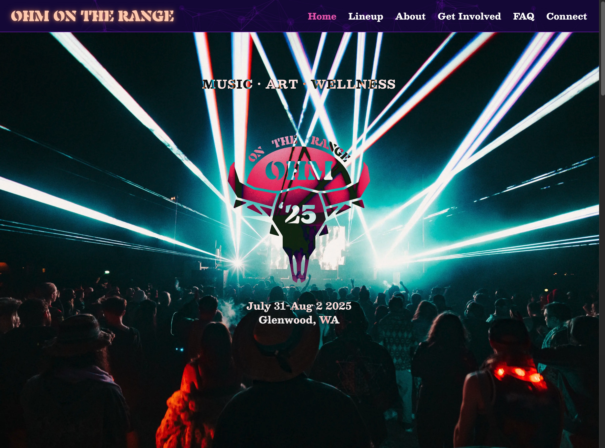

# 👋 Hello, I'm Rio.

Product-minded full-stack engineer shipping production software used by real teams. I specialize in cloud-based web and mobile apps with a focus on reliability, maintainability, and security. Experienced in both startup-style builds and compliance-heavy client environments.  

---

## 👨‍💻 Recent Projects

 &nbsp; DogTown &nbsp;  

A self-hosted photo-sharing app running on my Raspberry Pi 5 with OAuth auth, AI image moderation, and a real-time monitoring dashboard. Features Docker orchestration, CI/CD via GitHub Actions, and NGINX caching.

**Stack:** Next.js, React, TypeScript, Postgres, Docker, Python/FastAPI, Hono, Cloudflare Tunnel

[Visit](https://dogtown.dog) • [GitHub](https://github.com/rioredwards/pi-site)

 

&nbsp;  Ohm on the Range &nbsp;  

Festival website redesign that more than doubled traffic (3,000+ unique visitors first month) with near-perfect Lighthouse scores. Features a type-safe content pipeline generating UI, screen-reader content, and JSON-LD structured data from a single source.

**Stack:** Next.js, TypeScript, Tailwind, shadcn/ui, Figma, Vercel

[Visit](https://www.ohmontherange.net) • [Case Study](https://rioedwards.com/work/ohm-on-the-range)

 

&nbsp;  Error Affirmations &nbsp;  

 

A full-stack app that provides an API for delivering code-related affirmations to developers. The application includes 3 UI's: a VSCode Extension, a Jest Reporter and a website. 1,000+ downloads.

[VS Code Extension](https://marketplace.visualstudio.com/items?itemName=VSCodeEmpaths.erroraffirmations) • [Jest Reporter](https://www.npmjs.com/package/error-affirmations) • [Website](https://error-affirmations.netlify.app/) • [GitHub](https://github.com/orgs/VSCode-Empaths/repositories)

  

&nbsp; Swimmy Nudibranch &nbsp;  

An aquatic spin on the (in)famous iPhone game: "Flappy Bird". I built this with a small team for a 3-day hackathon, the theme being "Under the Sea". It features all original pixel art and music.

[Play](https://swimmy-nudibranch.netlify.app/) • [GitHub](https://github.com/Nervous-Nudibranchs/Swimmyy-Nudibranch)

 

 
 ---

## 🛠️ My Toolkit

|                                     Languages                                      |                           Libraries & Frameworks                           |                                                              Testing                                                               |                                   Databases                                    |                                                       Cloud                                                        |                                Other Tools                                |
| :--------------------------------------------------------------------------------: | :------------------------------------------------------------------------: | :--------------------------------------------------------------------------------------------------------------------------------: | :----------------------------------------------------------------------------: | :----------------------------------------------------------------------------------------------------------------: | :-----------------------------------------------------------------------: |
|      |            |                                                                           |  |  |  |
|  |             |  |           |                                                  |               |
|                  |      |                                                                                                                                    |             |                                               |                  |
|                   |            |                                                                                                                                    |                                                                                |                                                      |      |
|                 |     |                                                                                                                                    |                                                                                |                                                                                                                    |            |
|        |  |                                                                                                                                    |                                                                                |                                                                                                                    |          |
|              |                                                                            |                                                                                                                                    |                                                                                |                                                                                                                    |           |

# Contact Me

`Open for collaborations! Send me your ideas 📩`

