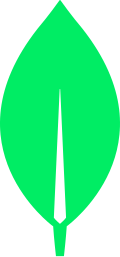

<h1 style="text-align: center;">👋 Hello, my name is Rio.</h1>

I'm a full-stack developer with a passion for building elegant, responsive, and accessible web apps. I thrive in an environment where my creativity and technical skills are valued. I am always seeking new opportunities to learn and grow as a developer, whether that means working independently or as part of a team. I care deeply for humanity and strive to have a positive impact on those around me.  

---

<h1 style="text-align: center;">🛠️ My Toolkit</h1>

|                                 Languages                                 |                          Libraries/Frameworks                           |                                           Testing                                           |                                 Databases                                 |                                Tools                                |
| :-----------------------------------------------------------------------: | :---------------------------------------------------------------------: | :-----------------------------------------------------------------------------------------: | :-----------------------------------------------------------------------: | :-----------------------------------------------------------------: |
|  |       |                                |  |    |
|            |       |  |        |       |
|               |   |                                                                                             |      |          |
|                |      |                                                                                             |                                                                           |  |
|                |  |                                                                                             |                                                                           |      |

---

<h1 style="text-align: center; margin-bottom: 16px;"> 👨‍💻 Recent Projects</h1>

 
 
 &nbsp;  <h3 style="text-align: center; cursor: pointer;"> Swimmy Nudibranch </h3>&nbsp;  

An aquatic spin on the (in)famous iPhone game: "Flappy Bird". I built this with a small team for a 3-day hackathon, the theme being "Under the Sea". It features all original pixel art and music.

[Play](https://swimmy-nudibranch.netlify.app/) • [GitHub](https://github.com/Nervous-Nudibranchs/Swimmyy-Nudibranch)

 

 
 

 
 
 &nbsp;  <h3  style="text-align: center; cursor: pointer;">Error Affirmations</h3>&nbsp;  

 

A full-stack app that provides an API for delivering code-related affirmations to developers. The application includes 3 UI's: a VSCode Extension, a Jest Reporter and a website.

[VS Code Extension](https://marketplace.visualstudio.com/items?itemName=VSCodeEmpaths.erroraffirmations) • [Jest Reporter](https://www.npmjs.com/package/error-affirmations) • [Website](https://error-affirmations.netlify.app/) • [GitHub](https://github.com/orgs/VSCode-Empaths/repositories)

  

 
 
 &nbsp;  <h3 style="text-align: center; cursor: pointer;"> Pictionary </h3>&nbsp;  

 
 

 

A multiplayer, real-time drawing game inspired by the popular board game, Pictionary. Players can sign-up, create or join a game room, and earn points as a drawer or guesser in 1-minute rounds.

[Play](https://moody-pictionary.netlify.app/) • [GitHub](https://github.com/themoodymarsupials/pictionary)

 
 ---

# Contact Me

`Open for collaborations! Send me your ideas 📩`

