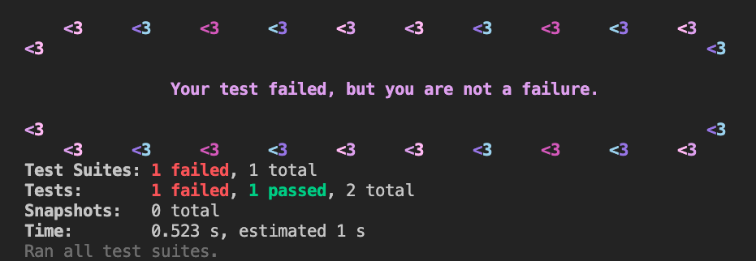

# 👋 Hello, my name is Rio

I'm a full-stack developer with a passion for building elegant, responsive, and accessible web apps. I thrive in an environment where my creativity and technical skills are valued. I am always seeking new opportunities to learn and grow as a developer, whether that means working independently or as part of a team. I care deeply for humanity and strive to have a positive impact on those around me.  

---

## 🛠️ My Toolkit

|                                     Languages                                      |                           Libraries & Frameworks                           |                                                              Testing                                                               |                                   Databases                                    |                                 Cloud                                 |                                Other Tools                                |
| :--------------------------------------------------------------------------------: | :------------------------------------------------------------------------: | :--------------------------------------------------------------------------------------------------------------------------------: | :----------------------------------------------------------------------------: | :-------------------------------------------------------------------: | :-----------------------------------------------------------------------: |
|      |            |                                                                           |  |     |  |
|  |             |  |           |  |               |
|                   |      |                                                                                                                                    |             |         |                  |
|                 |            |                                                                                                                                    |                                                                                |                                                                       |      |
|        |  |                                                                                                                                    |                                                                                |                                                                       |            |
|              |                                                                            |                                                                                                                                    |                                                                                |                                                                       |          |

## 👨‍💻 Recent Projects

 
 
 &nbsp;  <h3 style="text-align: center; cursor: pointer;"> Code Quest </h3>&nbsp;  

Level-Up your code with Code Quest! This immersive web app generates pseudo-random coding challenges, giving you the opportunity to learn practical coding skills in a fun and engaging way.

[Try](https://j-scribe.vercel.app/) • [GitHub](https://github.com/rioredwards/j-scribe)

 

 

 
 
 &nbsp;  <h3 style="text-align: center; cursor: pointer;"> j-scribe </h3>&nbsp;  

Your All-in-One JavaScript Sandbox and Notebook. j-scribe provides users with a versatile platform to create, share, and modify code snippets in real-time.

[Play](https://code-quest-app.netlify.app/) • [GitHub](https://github.com/rioredwards/code-quest)

 

 
 
 &nbsp;  <h3 style="text-align: center; cursor: pointer;"> Swimmy Nudibranch </h3>&nbsp;  

An aquatic spin on the (in)famous iPhone game: "Flappy Bird". I built this with a small team for a 3-day hackathon, the theme being "Under the Sea". It features all original pixel art and music.

[Play](https://swimmy-nudibranch.netlify.app/) • [GitHub](https://github.com/Nervous-Nudibranchs/Swimmyy-Nudibranch)

 

 
 

 
 
 &nbsp;  <h3  style="text-align: center; cursor: pointer;">Error Affirmations</h3>&nbsp;  

 

A full-stack app that provides an API for delivering code-related affirmations to developers. The application includes 3 UI's: a VSCode Extension, a Jest Reporter and a website.

[VS Code Extension](https://marketplace.visualstudio.com/items?itemName=VSCodeEmpaths.erroraffirmations) • [Jest Reporter](https://www.npmjs.com/package/error-affirmations) • [Website](https://error-affirmations.netlify.app/) • [GitHub](https://github.com/orgs/VSCode-Empaths/repositories)

  

 
 
 &nbsp;  <h3 style="text-align: center; cursor: pointer;"> Pictionary </h3>&nbsp;  

 
 

 

A multiplayer, real-time drawing game inspired by the popular board game, Pictionary. Players can sign-up, create or join a game room, and earn points as a drawer or guesser in 1-minute rounds.

[Play](https://moody-pictionary.netlify.app/) • [GitHub](https://github.com/themoodymarsupials/pictionary)

 
 ---

# Contact Me

`Open for collaborations! Send me your ideas 📩`

